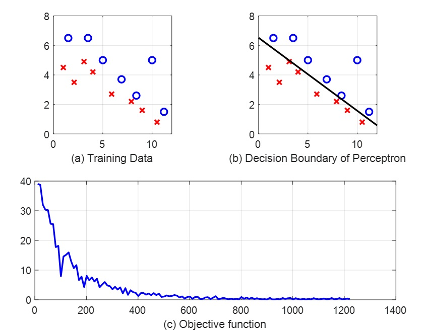

## Perceptron

Obtain linear discriminant function  with two different criterion： 1. classical  criterion of Perceptron 2. least squares

data_Perc.mat contains the data which can be separated by a linear function.

